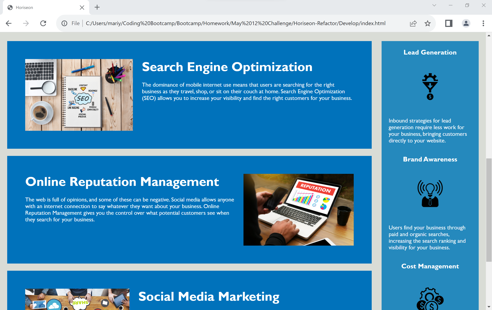
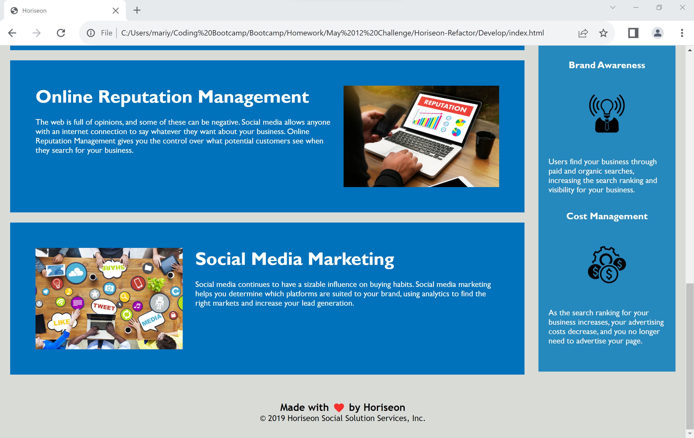

# Module 01 Challenge - Horiseon Code Refactor
## Mariya Setko

## Description

Marketing agency Horiseon required .html and .css code that met accessibility standards without changing the appearance or functionality of their existing site to ensure that their site was optimized for search engines.

This was accomplished through consolidation of redundancies, reformatting into sequential order following the visual flow of the website, and replacing non-semantic tags with semantic tags for further clarity. Alt descriptions and clear class names were added to all applicable sections. 

As a result of these changes, the code is now much easier to understand and follow, and meets accessibility standards as outlined in the Acceptance Criteria provided. 

Upon completion of this project, I learned that less is more when it comes to code. The simpler something can be made, the better. This way, you are setting yourself/other developers up for success and creating sustainable code that lends itself well to further updates with a reduced risk of issues. 

## Mockup vs. Final Product

